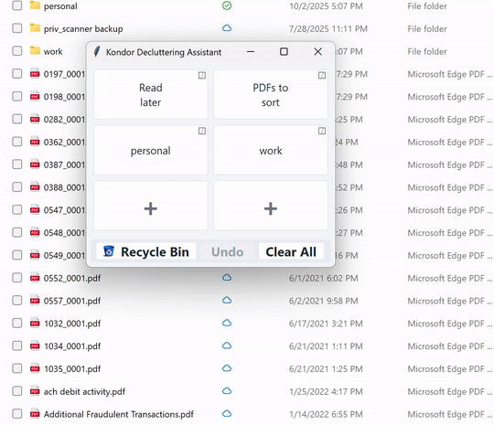

# Folder Declutter

Folder Declutter is a lightweight, always-on-top Windows utility designed to help you quickly organize files and folders. Drag items from your desktop or any Explorer window and drop them into configurable sections to move them instantly.




## Features

*   **Drag-and-Drop Organization**: Move files and folders to predefined locations by simply dragging and dropping them onto the application window.
*   **Configurable Sections**: Customize the 2x3 grid of sections to match your workflow. Assign a label and a destination folder to each section.
*   **Always-on-Top**: The window stays on top of your other applications for easy access.
*   **Click-Through Transparency**: The window becomes transparent to clicks when not in use, so it doesn't interfere with your work.
*   **Recycle Bin Integration**: Includes a dedicated section to send files directly to the Windows Recycle Bin.
*   **Undo**: Instantly undo the last file move operation.
*   **Mini-Overlay Mode**: When minimized, the application shows a small, movable overlay icon that you can double-click to restore the main window.
*   **Standalone Executable**: No installation required. The application runs as a single `.exe` file.

## How to Use

1.  Download the latest `FolderDeclutter.exe` from the [releases page](https://github.com/your-username/folder-declutter/releases) (link to be created).
2.  Run the executable.
3.  Right-click on any section to configure its label and target folder.
4.  Drag files or folders from your desktop or Windows Explorer and drop them onto a section to move them.
5.  Click the "Undo" button to reverse the last move.
6.  Minimize the window to switch to the mini-overlay mode. Double-click the overlay to bring back the main window.

## Building from Source

If you want to build the application from the source code, you'll need Python and the project's dependencies. The build process is intended for a **Windows environment**.

1.  **Clone the repository:**
    ```sh
    git clone https://github.com/your-username/folder-declutter.git
    cd folder-declutter
    ```

2.  **Create a virtual environment and install dependencies:**
    ```sh
    python -m venv .venv
    .venv\Scripts\activate
    pip install -r requirements.txt
    ```

3.  **Run the application:**
    ```sh
    python src/main.py
    ```

4.  **Build the executable:**
    The project uses PyInstaller to create a standalone executable. The build process is managed by the `build/package.py` script.

    To create the executable, run:
    ```sh
    python build/package.py build
    ```
    The final executable will be located in the `dist/DesktopSorter/` directory.

5.  **Clean the build artifacts:**
    To remove all generated build files, use the `clean` command:
    ```sh
    python build/package.py clean
    ```

## Configuration

The application stores its configuration in a `config.json` file located at `%APPDATA%\DesktopSorter\config.json`. You can manually edit this file to change the sections, but it's recommended to use the in-app right-click context menus.

Application logs are stored in `%APPDATA%\DesktopSorter\logs\`.

## License

This project is licensed under the MIT License. See the `LICENSE` file for details.
